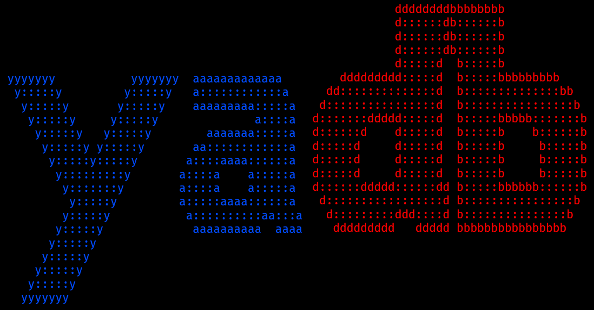

Yet Another Digital Board
-
Autor: Vít Barták

Webová aplikace - návrh digitální úřední desky, bakalářská práce.

Použité knihovny
-
*Backend*

Fat Free Framework (3.7.2): https://github.com/bcosca/fatfree *(GPLv3)*
* f3-cortex (1.7) : https://github.com/ikkez/f3-cortex  *(GPLv3)*

*Frontend*

Bootstrap (4.5.0): https://github.com/twbs/bootstrap *(MIT)*
* https://cdn.jsdelivr.net/npm/popper.js@1.16.0/dist/umd/popper.min.js
* https://code.jquery.com/jquery-3.5.1.slim.min.js (lokálně, kvůli offline funkčnosti)
* JQuery idle plugin https://github.com/kidh0/jquery.idle *(MIT)*

Datatables https://datatables.net/ *(MIT)*

Simple keyboard https://github.com/hodgef/simple-keyboard *(MIT)*

jQuery BlockUI Plugin https://github.com/malsup/blockui/ *(MIT)*

PDF.js https://github.com/mozilla/pdf.js *(Apache-2.0 License)*

Material Design (v budoucnu): https://material.io/resources/icons/?style=baseline (Apache License, Version 2.0)

Vyvíjeno za použití
-
XAMPP (PHP 7.4.8) https://www.apachefriends.org/index.html